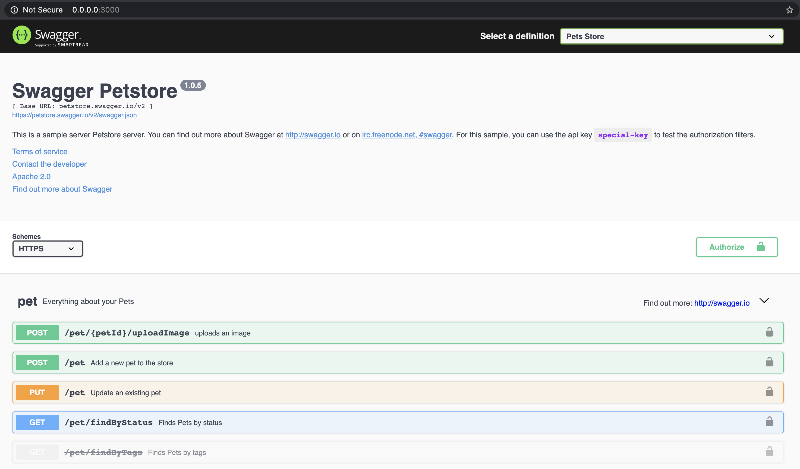

# swagger-api-browser
Browse you Swagger APIs documentation in a single catalog.

## Modifying the list of Swagger URLs
File `swagger-ui/index.html`
```js
...
// List of Swagger definitions URLs
const catalog = [{
  url: 'https://petstore.swagger.io/v2/swagger.json',
  name: 'Pets Store'
}]
...

```

## Starting the static HTTP server
```bash
npm start
```
> Swagger Documentation catalog is available at http://0.0.0.0:3000

